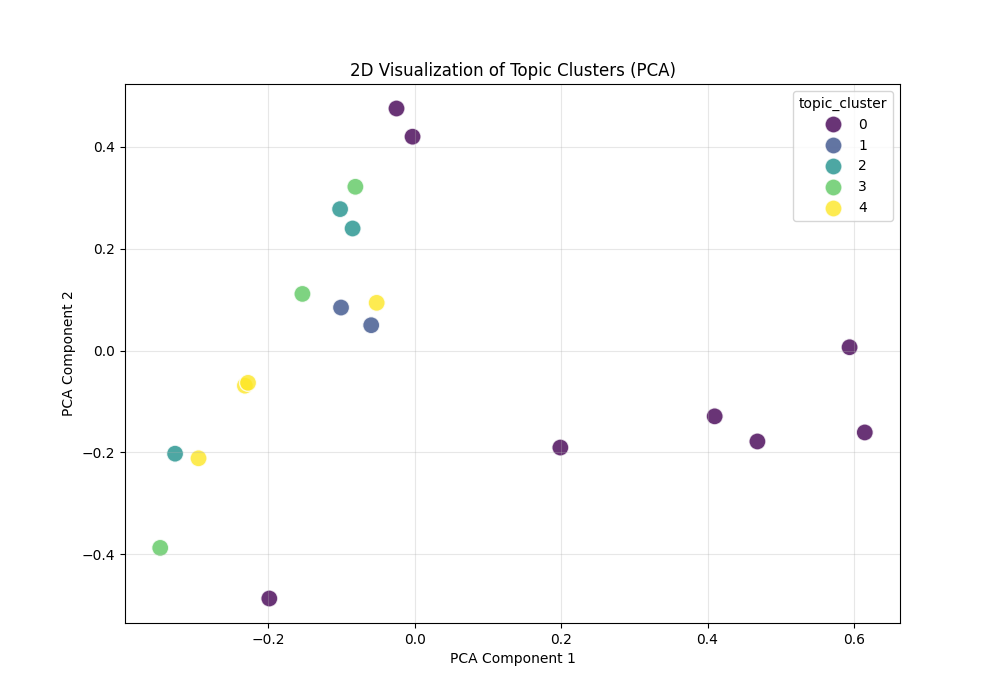
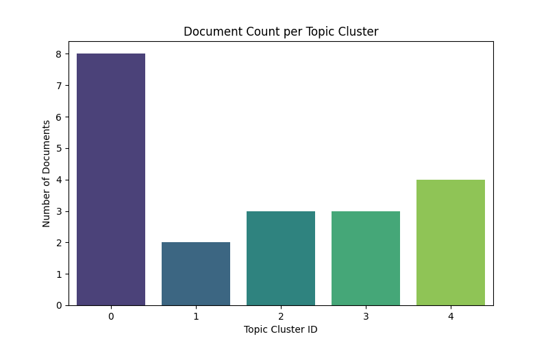
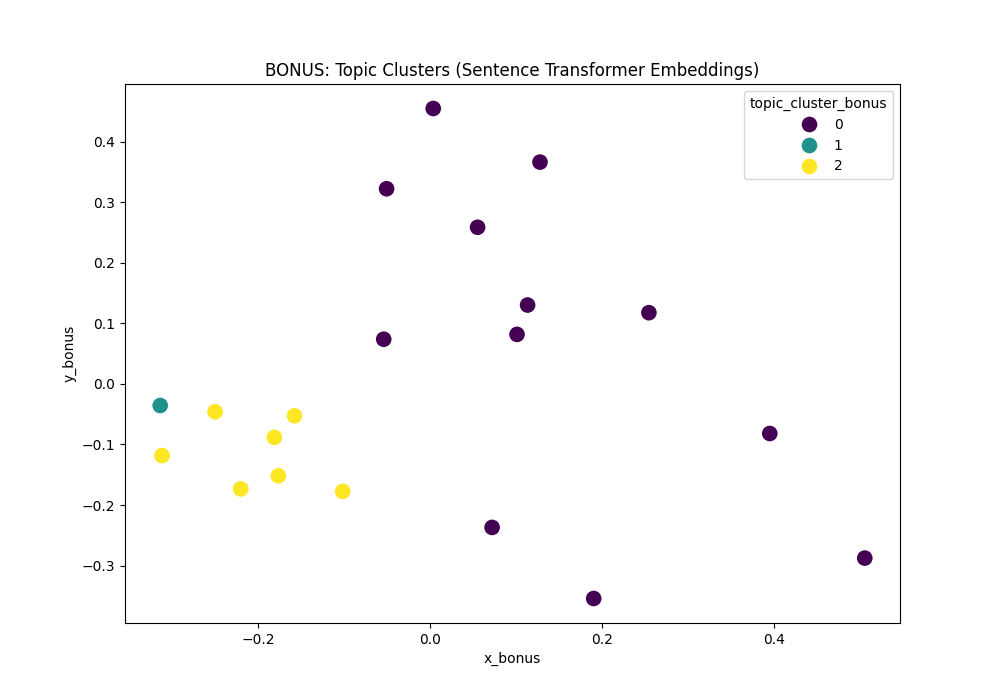

# Genomic Text Curation & Topic Grouping (NLP)

This project is a lightweight NLP pipeline built for a 24-hour take-home challenge. The system reads a collection of genomic research paper titles/abstracts and performs two main tasks:
1.  **Entity & Relation Extraction:** It extracts key entities (Genes, Variants, Diseases) and the relationships between them.
2.  **Topic Grouping:** It automatically groups documents into high-level thematic topics.

The pipeline was developed in two stages:
1.  **Method 1:** A baseline approach using custom regex, noun chunking, and TF-IDF clustering.
2.  **Method 2 (Bonus):** An improved method using a hybrid `scispacy` model and semantic `sentence-transformers`.

This repository presents the final, improved (Method 2) code and results.

## Setup & Run

1.  **Clone the repository:**
    git clone https://github.com/sivangichatterjee/genomic-nlp-challenge.git
    cd genomic-nlp-challenge

2.  **Install all required dependencies:**
    pip install pandas
    pip install spacy
    pip install scikit-learn
    pip install matplotlib
    pip install seaborn
    pip install sentence-transformers
    pip install scispacy
    
    # Install the scispaCy model
    pip install https://s3-us-west-2.amazonaws.com/ai2-s2-scispacy/releases/v0.5.3/en_core_sci_sm-0.5.3.tar.gz

    # Download the standard spaCy model
    python -m spacy download en_core_web_sm

This will process `texts.csv` and generate the final outputs:
* `curated_results.json`
* `topic_cluster_visualization.png`
* `topic_cluster_counts.png`

---

## Methodology

### Dataset
For the dataset, 20 of the publication names from https://advp.niagads.org/publications were used.

### Method 1: Baseline (Rule-Based Extraction & TF-IDF)

**Entity Extraction:**
    1.  **Genes & Variants:** Used specific regex patterns (`rs\d+` for variants, `\b[A-Z0-9]{3,8}\b` for genes) with a noise-word filter.
    2.  **Diseases:** A more complex approach was used:
        * `spaCy` was used to identify **noun chunks**.
        * **Regex** was applied to these chunks to find capitalized disease-like phrases.
        * A custom list of **common diseases** (e.g., "Stroke," "Dementia") was used to catch known terms.
        * Logic was added to handle **splitters/connectors** (e.g., "and," "with," "vs") to separate distinct diseases within a single phrase (like "Overlap Between ALS and FTD").

**Relation Extraction:**
    * A list of keywords (e.g., "associated with," "linked to") was used to find relationships.
    * The `evidence_span` was saved as the **entire text** of the document for simplicity.

* **Clustering:**
    * Texts were vectorized using **TF-IDF**.
    * **K-Means clustering** was applied (testing both `k=3` and `k=5`) to group the documents.
    * The resulting clusters were plotted (PCA visualization and a bar chart of counts).

### Method 2: Improved (Hybrid Extraction & Semantic Clustering)
The bonus approach uses pre-trained models.

**Hybrid Entity Extraction:**
    1.  The `scispaCy` model (`en_core_sci_sm`) was used to identify all potential biomedical `ENTITY` spans.
    2.  These candidates were then filtered using our simple rules (e.g., `re.fullmatch` for gene patterns, keyword checks for diseases).
    3.  This **"hybrid" method** (ML model + rules) was used for the extraction.

**Semantic Clustering:**
    1.  The `sentence-transformers` library (`all-MiniLM-L6-v2` model) was used to create embeddings.
    2.  This model understands the semantic meaning of a text, not just its keywords. This provides far more meaningful topic groups (eg it knows "Alzheimer's" and "dementia" are related).
    3.  K-Means was then applied to these high-quality embeddings.

---

## 📊 Results & Outputs

### Plots
**This scatter plot visualizes the topic clusters, showing how semantically similar documents are grouped together in 2D space.**


**This bar chart shows the total number of documents found in each topic, indicating the size and distribution of the clusters.**


**This plot shows the topic clusters derived from semantic sentence embeddings. It visually confirms that documents are grouped by their meaning and context, not just by sharing the same keywords.**



### Sample Curation Output (`curated_results.json`)
The final JSON output from the hybrid pipeline, ready for review.

```json
[
  {
    "text-id": "T4",
    "variants": [],
    "genes": [
      "PCDH11X"
    ],
    "diseases": [
      "Alzheimer's disease"
    ],
    "relations": [
      "associated with"
    ],
    "evidence_span": "Genetic variation in PCDH11X is associated with susceptibility to late-onset Alzheimer's disease."
  },
  {
    "text-id": "T5",
    "variants": [],
    "genes": [
      "TREM2"
    ],
    "diseases": [
      "Alzheimer's disease"
    ],
    "relations": [],
    "evidence_span": "TREM2 variants in Alzheimer's disease."
  }
]
```

## Curation Schema

The `curated_results.json` file is an array of objects, where each object represents a single "fact" or relationship extracted from the text. 
The `curated_results_bonus.json` file is the same but with Sentence Transformer embeddding and Hybrid extraction method.
The fields are:

* **`text_id`**: The ID from the input `texts.csv`. This is crucial for tracing a fact back to its original source document.
* **`variant`**: The `rsID` (e.g., "rs429358") found in the text. This is the genetic variant of interest.
* **`gene`**: The gene symbol (e.g., "APOE") identified. This is the primary genetic subject.
* **`phenotype`**: The disease or phenotype (e.g., "Alzheimer's disease") that is the outcome or subject of the study.
* **`relation`**: The keyword (e.g., "associated with") that links the subject (gene/variant) and the object (phenotype).
* **`evidence_span`**: The full text from which the fact was extracted. This is the most important field for a human curator, as it allows them to **verify the extraction** and check the context without finding the original paper.

---

## Discussion: Limitations & Next Steps

While this pipeline successfully extracts entities and topics, it has several limitations that provide clear next steps for improvement.

* **Limitation: Naive Relation Extraction**
    The current script only checks if a gene, disease, and relation keyword *all exist* in the same text. It doesn't prove they are grammatically linked (e.g., "APOE... *studies of*... Alzheimer's disease" might be incorrectly linked by "studies of").
    * **Next Step:** Implement **dependency parsing** (using spaCy) to find the grammatical relationship. We could check if a gene is the subject (`nsubj`) and the disease is the object (`dobj`) of a relation keyword.

* **Limitation: No Entity Normalization**
    The pipeline extracts entities exactly as they appear (e.g., "Alzheimer's disease," "Alzheimer's," "AD"). For a database, these are all different strings, even though they mean the same thing.
    * **Next Step:** Integrate an **entity linker** (like `scispaCy`'s) to normalize all found entities to a standard ontology, such as MeSH (Medical Subject Headings) or DOID (Disease Ontology). This would map "AD" and "Alzheimer's disease" to the same unique ID (e.g., `MESH:D000544`).

* **Limitation: JSON is not a "Curator View"**
    A raw JSON file is difficult for a non-technical curator to use. The assignment mentions a "curator view" as a goal.
    * **Next Step:** Build a simple **Streamlit or Flask web application**. This app would read the `curated_results.json` and display it in a searchable, filterable web table, allowing a curator to easily approve, reject, or edit entries.

* **Limitation: No Formal Error Analysis**
    The prompt suggested an error analysis, which I haven't formally completed. The hybrid model is good, but it's not perfect.
    * **Next Step:** Manually review a sample of 20 texts to find 5 **false positives** (incorrectly extracted facts) and 5 **false negatives** (missed facts). This analysis would guide the next round of improvements to the extraction logic.


